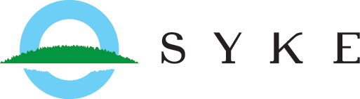
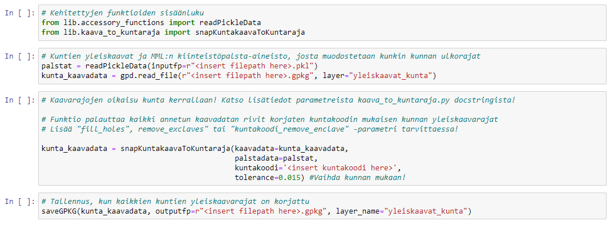

<!-- Improved compatibility of back to top link: See: https://github.com/othneildrew/Best-README-Template/pull/73 -->
<a name="readme-top"></a>
<!--
*** Thanks for checking out the Best-README-Template. If you have a suggestion
*** that would make this better, please fork the repo and create a pull request
*** or simply open an issue with the tag "enhancement".
*** Don't forget to give the project a star!
*** Thanks again! Now go create something AMAZING! :D
-->


<!-- PROJECT SHIELDS -->
<!--
*** I'm using markdown "reference style" links for readability.
*** Reference links are enclosed in brackets [ ] instead of parentheses ( ).
*** See the bottom of this document for the declaration of the reference variables
*** for contributors-url, forks-url, etc. This is an optional, concise syntax you may use.
*** https://www.markdownguide.org/basic-syntax/#reference-style-links
-->
[![Contributors][contributors-shield]][contributors-url]
[![Forks][forks-shield]][forks-url]
[![Issues][issues-shield]][issues-url]
[![MIT License][license-shield]][license-url]


<!-- ETUSIVU -->
<br />
<div align="center">
  <a href="https://www.syke.fi/fi-FI">
    
  </a>

<h3 align="center">VOOKA</h3>

  <p align="center">
    Voimassa olevat kaavat rakennetun ympäristön tietojärjestelmään -pilotti
    <br> 06/2022-02/2023
    <br />
    <br />
    <a href="https://www.syke.fi/fi-FI/Tutkimus__kehittaminen/Tutkimus_ja_kehittamishankkeet/Hankkeet/Voimassa_olevat_kaavat_rakennetun_ympariston_tietojarjestelmaan_VOOKA"><strong>Tutustu hankkeeseen »</strong></a>
    <br />
    <br />
    <a href="https://github.com/ubigu/vooka/issues">Raportoi bugi</a>
  </p>
</div>


<!-- SISÄLLYSLUETTELO -->
<details>
  <summary>Sisällysluettelo</summary>
  <ol>
    <li>
      <a href="#projektista">Projektista</a>
      <ul>
        <li><a href="#ohjelmointi">Ohjelmointi</a></li>
      </ul>
    </li>
    <li>
      <a href="#aloitus">Aloitus</a>
      <ul>
        <li><a href="#ennakkoehdot">Ennakkoehdot</a></li>
        <li><a href="#asennus">Asennus</a></li>
      </ul>
    </li>
    <li><a href="#käytöstä">Käytöstä</a></li>
    <li><a href="#jatkokehittäminen">Jatkokehittäminen</a></li>
    <li>
      <a href="#ota-yhteyttä">Ota yhteyttä</a>
      <ul>
        <li><a href="#tilaaja">Tilaaja</a></li>
        <li><a href="#konsultti">Konsultti</a></li>
      </ul>
    </li>
    <li><a href="#konsulttiryhmittymä">Konsulttiryhmittymä</a></li>
  </ol>
</details>


<!-- PROJEKTISTA -->
## Projektista

Suomen ympäristökeskuksen (SYKE) tilaaman VOOKA-hankkeen tavoitteena oli tuottaa Etelä-Savon ELY-keskuksen alueen kuntien voimassa olevien asema- ja yleiskaavojen kaavarajoista valtakunnallisesti yhteentoimiva, tietomallimuotoinen aineisto. Mukaan on linkitetty myös kaavan liitteet (esim. kaavakartta). Työ oli osa Ryhti-hanketta, jossa tavoitellaan rakennetun ympäristön keskeisten tietojen kokoamista keskitetysti ja laadukkaasti uuteen Rakennetun ympäristön tietojärjestelmään (RYTJ).

VOOKA-hankkeessa tunnistettiin tarve ETL-tyyppisen (Extract, Transform, Load) työkalun kehittämiselle ja testaukselle. Suomessa kaavojen ulkorajatietoja on perinteisesti kerätty ELY-keskuksiin sekä Maanmittauslaitokselle (MML) kunnan kaavaindeksien muodostamisprosessien ohessa. Laadukkaan tietomallimuotoisen aineiston tuottaminen vaatii näiden aineistojen vertailua sekä geometris-topologisen laadun arviointia. 

ETL-työkalun kehittäminen perustui täysin avoimeen lähdekoodiin ja on tämän sivuston kautta hyödynnettävissä Jupyter Notebookina. ETL-työkalu koostuu kuudesta osasta:
1. [Tiedonkeruu ja esikäsittely](https://github.com/ubigu/vooka/blob/master/1-tiedonkeruu-ja-esikasittely.ipynb)
2. Tiedon yhdistely
3. Tiedon korjaukset
4. Tiedon vertailu
5. PDF-linkityskonversio
6. Kaavatietomallin implementointi

Työ toteutettiin tiiviissä yhteistyössä Etelä-Savon ELY-keskuksen sekä kuntien kanssa.

### Ohjelmointi

* [![Jupyter][Jupyter-shield]][Jupyter-url]
* [![Anaconda][Anaconda-shield]][Anaconda-url]
* [![Python][Python-shield]][Python-url]

<p align="right"><a href="#readme-top">Takaisin alkuun</a></p>


<!-- ALOITUS -->
## Aloitus

### Ennakkoehdot

Katso `requirements.txt`

### Asennus

1. Kloonaa repo haluamaasi kansioon
   ```sh
   git clone https://github.com/ubigu/vooka.git
   ```
2. Käynnistä käyttämäsi Python env
   ```sh
   conda activate <python env>
   ```
3. Asenna ennakkoehtoihin listatut moduulit. Esimerkiksi:
   ```sh
   conda install -c conda-forge geopandas=0.6.1
   ```
4. Käynnistä Jupyter Notebook
   ```sh
   jupyter notebook
   ```
5. Käynnistä .ipynb listauksen mukaisesti kansiosta, johon kloonasit repon

<p align="right"><a href="#readme-top">Takaisin alkuun</a></p>


<!-- KÄYTÖSTÄ -->
## Käytöstä

ETL-työkalua ajetaan Jupyter Notebook-järjestyksessä 1-6. Kussakin ipynb-tiedostossa on markdown-muotoista kerronnallista tekstiä, joka opastaa käyttäjää koodin ajamisessa. Koodisolut on rakennettu notebookeihin esitäytettyinä. Käyttäjän tarvitsee lisätä niihin ainoastaan tiedostopolut sekä parametrit. Lisätietoja parametreista löytyy myös kehitettyjen funktioiden docstringeista.

Kaikki ETL-työkaluun kehitetyt funktiot löytyvät [GitHubin lib-kansiosta](https://github.com/ubigu/vooka/tree/master/lib).

<div align="center">
  <a href="https://github.com/ubigu/vooka">
    
  </a>
</div>

_Esimerkki ETL-työkalun ajettavista koodeista Jupyter Notebookissa._

<p align="right"><a href="#readme-top">Takaisin alkuun</a></p>


<!-- JATKOKEHITTÄMINEN -->
## Jatkokehittäminen

Kaikki VOOKA-pilotissa kehitetyt ohjelmakoodit on avoimesti hyödynnettävissä ja jatkokehitettävissä. **Arvostamme suuresti** kaikkea tulevaisuuden jatkokehittämistä!

Jos sinulla on ehdotuksia, joilla ETL-työkalua voisi parantaa, forkkaa repo ja tee pull request. Voit myös avata issuen tagilla "parannus". Älä unohda antaa projektille tähteä! Kiitos!

1. Forkkaa projekti
2. Luo feature branch (`git checkout -b feature/HuippuFeature`)
3. Committaa muutokset (`git commit -m 'Lisätään HuippuFeature'`)
4. Push branch (`git push origin feature/HuippuFeature`)
5. Avaa pull request

<p align="right"><a href="#readme-top">Takaisin alkuun</a></p>


<!-- OTA YHTEYTTÄ -->
## Ota yhteyttä

### Tilaaja
Kaarina Vartiainen (erikoistutkija) \
Suomen ympäristökeskus SYKE, VOOKA-hankkeen projektipäällikkö \
kaarina.vartiainen@syke.fi \
p. 050 436 1796

### Konsultti
Ilpo Tammi (toimitusjohtaja) \
Ubigu Oy, pilottivaiheen konsulttiryhmittymän yhteyshenkilö \
ilpo.tammi@ubigu.fi \
p. 050 434 7939

Samuli Massinen (paikkatietoarkkitehti) \
Ubigu Oy, pilottivaiheen ETL-työkalun kehittäjä \
samuli.massinen@ubigu.fi \
p. 040 547 9806

<p align="right"><a href="#readme-top">Takaisin alkuun</a></p>


<!-- KONSULTTIRYHMITTYMÄ -->
## Konsulttiryhmittymä

* [Ubigu Oy](https://www.ubigu.fi/fi/)
* [Gispo Oy](https://www.gispo.fi/en/)
* [PlanDisain Oy](https://www.plandisain.fi/)

<p align="right"><a href="#readme-top">Takaisin alkuun</a></p>


<!-- MARKDOWN LINKIT & KUVAT -->
<!-- https://www.markdownguide.org/basic-syntax/#reference-style-links -->
[contributors-shield]: https://img.shields.io/github/contributors/ubigu/vooka?color=brightgreen&style=for-the-badge
[contributors-url]: https://github.com/ubigu/vooka/graphs/contributors
[forks-shield]: https://img.shields.io/github/forks/ubigu/vooka?color=blue&style=for-the-badge
[forks-url]: https://github.com/ubigu/vooka/network/members
[issues-shield]: https://img.shields.io/github/issues/ubigu/vooka?color=yellow&style=for-the-badge
[issues-url]: https://github.com/ubigu/vooka/issues
[license-shield]: https://img.shields.io/github/license/ubigu/vooka.svg?style=for-the-badge
[license-url]: https://github.com/ubigu/vooka/blob/master/LICENSE
[Jupyter-shield]: https://img.shields.io/badge/jupyter-%23FA0F00.svg?style=for-the-badge&logo=jupyter&logoColor=white
[Jupyter-url]: https://jupyter.org/
[Anaconda-shield]: https://img.shields.io/badge/Anaconda-%2344A833.svg?style=for-the-badge&logo=anaconda&logoColor=white
[Anaconda-url]: https://www.anaconda.com/
[Python-shield]: https://img.shields.io/badge/python-3670A0?style=for-the-badge&logo=python&logoColor=ffdd54
[Python-url]: https://www.python.org/
